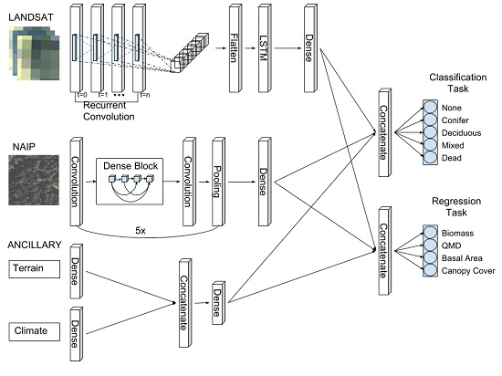

# Chimera-RCNN

Welcome to the repository for [CSP Chimera forest structure and classification deep learning model](https://www.mdpi.com/2072-4292/11/7/768).



This repo provide the CSP Chimera deep learning model ensemble for determining biomass from NAIP, LANDSAT,  terrain features, and climate as predictor variables in a merged [RCNN architecture](output/chimera_rcnn_architecture.png). We utilize a DenseNet architecture to identify features in the 1m resolution NAIP imagery. Simultaneously, we use two separate RCNNs, one for a 12 time step Landsat sequence, and one for a 360 time step PRISM climate data sequence, and concatenate their respective final dense layers to predict wood biomass and a forest classification. We additionally add a simple MLP of terrain features (elevation, slope, and aspect) as another information source for the final model prediction.

This model is experimental and is still in development.

Training data for this model, were derived from ~10000 field collected plots from the Forest Inventory and Analysis program, that measure the plot tree class and biomass using four seperate subplots encompassing a 120x120m sample area. For this repository, we provide a subset of data for testing model fitting and analysis of results. 

## Example Prediction with Chimera-RCNN


## Getting Started

1. Build your development environments

For example 
```
$ cd docker
$ sudo docker build . -t tonychangcsp/keras:latest
```

2. Clone this repo

3. Download training and validation data

4. Follow numbered Jupyter notebook steps. 

## Authors

* **Tony Chang** - *Initial work and development* - [CSP](http://www.csp-inc.org/about-us/core-science-staff/chang-tony/)

## Contributors

* **Brandon Rasmussen** - *Data acquisition and development*  
* **Luke Zachmann** - *Co-investigator*
* **Brett Dickson** - *Co-investigator*

## License 

This project is licensed under the CSP License and GPL - see the CSP_LICENSE and LICENSE file for details.

## Citation 

Please cite this project as:

*Chang, T., Rasmussen, B.P., Dickson, B.G., and Zachmann, L.J. 2019. "Chimera: A Multi-Task Recurrent Convolutional Neural Network for Forest Classification and Structural Estimation." Remote Sensing 11.7: 768.*

## Thanks and Support

This project would have not been possible without support from the [David H. Smith Fellowship](https://conbio.org/mini-sites/smith-fellows), the [Tahoe-Truckee Community Foundation](https://www.ttcf.net), the USDA [FIA Program](https://fia.fs.fed.us), and [Microsoft AI for Earth Grant](https://www.microsoft.com/en-us/ai/ai-for-earth).
